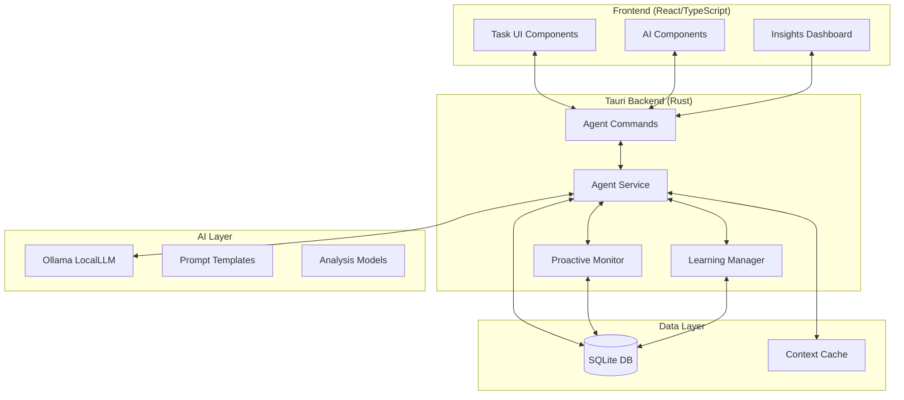

# AI Agent Evolution - 技術設計書

## 🏗️ システムアーキテクチャ

### 全体構成


## 🧠 コアモジュール設計

### 1. Enhanced Agent Service

#### 1.1 時間コンテキスト注入
```rust
// src-tauri/src/services/temporal_context.rs
use chrono::{DateTime, Local, Utc, Weekday, Duration};
use serde::{Serialize, Deserialize};

#[derive(Debug, Clone, Serialize, Deserialize)]
pub struct TemporalContext {
    pub current_datetime: DateTime<Local>,
    pub utc_datetime: DateTime<Utc>,
    pub timezone: String,
    pub weekday: Weekday,
    pub is_business_day: bool,
    pub season: Season,
    pub working_hours: WorkingHours,
    pub relative_time_map: RelativeTimeMap,
}

#[derive(Debug, Clone, Serialize, Deserialize)]
pub struct RelativeTimeMap {
    pub today: String,
    pub tomorrow: String,
    pub next_week: String,
    pub next_monday: String,
    pub business_days_ahead: std::collections::HashMap<u32, String>,
}

impl TemporalContext {
    pub fn new() -> Self {
        let now = Local::now();
        Self {
            current_datetime: now,
            utc_datetime: now.with_timezone(&Utc),
            timezone: "Asia/Tokyo".to_string(),
            weekday: now.weekday(),
            is_business_day: Self::is_business_day(now.weekday()),
            season: Self::calculate_season(now.month()),
            working_hours: WorkingHours::default(),
            relative_time_map: Self::build_relative_time_map(now),
        }
    }
    
    pub fn inject_into_prompt(&self, prompt: &str) -> String {
        format!(
            "現在時刻: {} ({})\n今日: {} ({})\n営業日: {}\n\n{}",
            self.current_datetime.format("%Y-%m-%d %H:%M:%S"),
            self.weekday,
            self.current_datetime.format("%Y-%m-%d"),
            if self.is_business_day { "営業日" } else { "非営業日" },
            self.is_business_day,
            prompt
        )
    }
    
    fn build_relative_time_map(now: DateTime<Local>) -> RelativeTimeMap {
        RelativeTimeMap {
            today: now.format("%Y-%m-%d").to_string(),
            tomorrow: (now + Duration::days(1)).format("%Y-%m-%d").to_string(),
            next_week: (now + Duration::weeks(1)).format("%Y-%m-%d").to_string(),
            next_monday: Self::next_weekday(now, Weekday::Mon).format("%Y-%m-%d").to_string(),
            business_days_ahead: Self::calculate_business_days_ahead(now, 30),
        }
    }
}
```

#### 1.2 タスクコンテキスト統合
```rust
// src-tauri/src/services/task_context.rs
use crate::models::Task;
use sqlx::SqlitePool;

#[derive(Debug, Clone, Serialize, Deserialize)]
pub struct TaskContext {
    pub related_tasks: Vec<Task>,
    pub dependency_chain: Vec<TaskDependency>,
    pub productivity_insights: ProductivityInsights,
    pub current_workload: WorkloadAnalysis,
    pub project_status: HashMap<String, ProjectStatus>,
}

#[derive(Debug, Clone, Serialize, Deserialize)]
pub struct ProductivityInsights {
    pub avg_completion_time: HashMap<String, f32>, // タグ別平均完了時間
    pub peak_hours: Vec<TimeRange>,                // 生産性ピーク時間
    pub delay_patterns: DelayAnalysis,             // 遅延パターン
    pub success_rates: HashMap<String, f32>,       // タイプ別成功率
}

impl TaskContext {
    pub async fn build_for_task(db: &SqlitePool, task_id: &str) -> Result<Self, sqlx::Error> {
        let related_tasks = Self::get_related_tasks(db, task_id).await?;
        let dependencies = Self::analyze_dependencies(db, task_id).await?;
        let insights = Self::calculate_productivity_insights(db).await?;
        let workload = Self::analyze_current_workload(db).await?;
        let project_status = Self::get_project_statuses(db).await?;
        
        Ok(Self {
            related_tasks,
            dependency_chain: dependencies,
            productivity_insights: insights,
            current_workload: workload,
            project_status,
        })
    }
    
    pub fn to_prompt_context(&self) -> String {
        format!(
            "タスクコンテキスト:\n\
            - 関連タスク数: {}\n\
            - 依存関係: {}\n\
            - 現在のワークロード: {} タスク\n\
            - 平均完了時間: {:?}\n\
            - 成功率: {:?}",
            self.related_tasks.len(),
            self.dependency_chain.len(),
            self.current_workload.total_tasks,
            self.productivity_insights.avg_completion_time,
            self.productivity_insights.success_rates
        )
    }
}
```

### 2. Proactive Monitoring System

#### 2.1 リアルタイム監視エンジン
```rust
// src-tauri/src/services/proactive_monitor.rs
use tokio::time::{interval, Duration};
use std::sync::Arc;
use tokio::sync::RwLock;

pub struct ProactiveMonitor {
    db: SqlitePool,
    agent_service: Arc<AgentService>,
    config: MonitoringConfig,
    alert_queue: Arc<RwLock<Vec<ProactiveAlert>>>,
    is_running: Arc<RwLock<bool>>,
}

#[derive(Debug, Clone)]
pub struct MonitoringConfig {
    pub check_interval: Duration,
    pub risk_sensitivity: RiskSensitivity,
    pub enabled_checks: Vec<CheckType>,
    pub notification_thresholds: NotificationThresholds,
}

#[derive(Debug, Clone)]
pub enum CheckType {
    DeadlineApproaching,
    DependencyBlocked,
    LongStagnation,
    WorkloadImbalance,
    ProjectRisk,
}

impl ProactiveMonitor {
    pub fn new(db: SqlitePool, agent_service: Arc<AgentService>) -> Self {
        Self {
            db,
            agent_service,
            config: MonitoringConfig::default(),
            alert_queue: Arc::new(RwLock::new(Vec::new())),
            is_running: Arc::new(RwLock::new(false)),
        }
    }
    
    pub async fn start_monitoring(&self) -> Result<(), AgentError> {
        let mut running = self.is_running.write().await;
        if *running {
            return Ok(());
        }
        *running = true;
        
        let db = self.db.clone();
        let agent = self.agent_service.clone();
        let alert_queue = self.alert_queue.clone();
        let is_running = self.is_running.clone();
        let config = self.config.clone();
        
        tokio::spawn(async move {
            let mut interval = interval(config.check_interval);
            
            while *is_running.read().await {
                interval.tick().await;
                
                if let Err(e) = Self::run_analysis_cycle(&db, &agent, &alert_queue, &config).await {
                    log::error!("プロアクティブ分析エラー: {}", e);
                }
            }
        });
        
        Ok(())
    }
    
    async fn run_analysis_cycle(
        db: &SqlitePool,
        agent: &AgentService,
        alert_queue: &Arc<RwLock<Vec<ProactiveAlert>>>,
        config: &MonitoringConfig,
    ) -> Result<(), AgentError> {
        let tasks = Self::get_active_tasks(db).await?;
        let temporal_context = TemporalContext::new();
        
        for check_type in &config.enabled_checks {
            match check_type {
                CheckType::DeadlineApproaching => {
                    let alerts = Self::check_approaching_deadlines(&tasks, &temporal_context)?;
                    Self::enqueue_alerts(alert_queue, alerts).await;
                }
                CheckType::DependencyBlocked => {
                    let alerts = Self::check_dependency_blocks(db, &tasks).await?;
                    Self::enqueue_alerts(alert_queue, alerts).await;
                }
                CheckType::LongStagnation => {
                    let alerts = Self::check_stagnation(&tasks, &temporal_context)?;
                    Self::enqueue_alerts(alert_queue, alerts).await;
                }
                // ... 他のチェックタイプ
            }
        }
        
        Ok(())
    }
}
```

#### 2.2 予測分析システム
```rust
// src-tauri/src/services/predictive_analyzer.rs
pub struct PredictiveAnalyzer {
    db: SqlitePool,
    learning_data: Arc<RwLock<LearningData>>,
}

#[derive(Debug, Clone)]
pub struct PredictionResult {
    pub completion_probability: f32,
    pub estimated_completion_date: DateTime<Local>,
    pub confidence_level: f32,
    pub risk_factors: Vec<RiskFactor>,
    pub recommendations: Vec<ActionRecommendation>,
}

impl PredictiveAnalyzer {
    pub async fn predict_task_completion(&self, task: &Task) -> Result<PredictionResult, AgentError> {
        let historical_data = self.get_historical_data_for_task(task).await?;
        let current_context = TaskContext::build_for_task(&self.db, &task.id).await?;
        let temporal_context = TemporalContext::new();
        
        // 機械学習的アプローチ（シンプルな統計ベース）
        let base_estimate = self.calculate_base_estimate(&historical_data, task)?;
        let context_adjustments = self.apply_context_adjustments(&current_context, &base_estimate)?;
        let temporal_adjustments = self.apply_temporal_adjustments(&temporal_context, &context_adjustments)?;
        
        // 信頼度計算
        let confidence = self.calculate_confidence(&historical_data, &current_context)?;
        
        // リスク要因特定
        let risks = self.identify_risk_factors(task, &current_context, &temporal_context)?;
        
        // 推奨事項生成
        let recommendations = self.generate_recommendations(&risks, &temporal_adjustments)?;
        
        Ok(PredictionResult {
            completion_probability: temporal_adjustments.success_probability,
            estimated_completion_date: temporal_adjustments.estimated_date,
            confidence_level: confidence,
            risk_factors: risks,
            recommendations,
        })
    }
}
```

### 3. Learning & Adaptation Engine

#### 3.1 パターン学習システム
```rust
// src-tauri/src/services/learning_manager.rs
pub struct LearningManager {
    db: SqlitePool,
    user_patterns: Arc<RwLock<UserWorkingPattern>>,
    feedback_processor: FeedbackProcessor,
}

#[derive(Debug, Clone, Serialize, Deserialize)]
pub struct UserWorkingPattern {
    pub user_id: String,
    pub productivity_profile: ProductivityProfile,
    pub task_preferences: TaskPreferences,
    pub time_management_style: TimeManagementStyle,
    pub feedback_patterns: FeedbackPatterns,
    pub accuracy_metrics: AccuracyMetrics,
    pub last_updated: DateTime<Utc>,
}

impl LearningManager {
    pub async fn process_task_completion(&self, task: &Task, actual_duration: Duration) -> Result<(), AgentError> {
        // 実績データの記録
        self.record_completion_data(task, actual_duration).await?;
        
        // パターンの更新
        self.update_productivity_patterns(task, actual_duration).await?;
        
        // 予測精度の評価
        self.evaluate_prediction_accuracy(task, actual_duration).await?;
        
        // 学習モデルの調整
        self.adjust_learning_parameters().await?;
        
        Ok(())
    }
    
    pub async fn process_user_feedback(&self, feedback: &UserFeedback) -> Result<(), AgentError> {
        // フィードバックデータの保存
        self.store_feedback(feedback).await?;
        
        // 提案システムの調整
        self.adjust_suggestion_weights(feedback).await?;
        
        // パーソナライゼーション強化
        self.enhance_personalization(feedback).await?;
        
        Ok(())
    }
    
    async fn update_productivity_patterns(&self, task: &Task, actual_duration: Duration) -> Result<(), AgentError> {
        let mut patterns = self.user_patterns.write().await;
        
        // 時間帯別の生産性更新
        let hour = Local::now().hour();
        patterns.productivity_profile.hourly_efficiency
            .entry(hour)
            .and_modify(|e| e.update_with_new_data(actual_duration))
            .or_insert(EfficiencyData::new(actual_duration));
        
        // タスクタイプ別の性能更新
        if let Some(task_type) = &task.tags.first() {
            patterns.task_preferences.type_performance
                .entry(task_type.clone())
                .and_modify(|e| e.update_performance(actual_duration))
                .or_insert(TaskTypePerformance::new(actual_duration));
        }
        
        // 複雑度別の見積もり精度更新
        let complexity = self.estimate_task_complexity(task);
        patterns.task_preferences.complexity_estimation
            .entry(complexity)
            .and_modify(|e| e.update_accuracy(actual_duration))
            .or_insert(ComplexityData::new(actual_duration));
        
        patterns.last_updated = Utc::now();
        
        Ok(())
    }
}
```

#### 3.2 フィードバック処理システム
```rust
// src-tauri/src/services/feedback_processor.rs
pub struct FeedbackProcessor {
    db: SqlitePool,
}

#[derive(Debug, Clone, Serialize, Deserialize)]
pub struct UserFeedback {
    pub feedback_id: String,
    pub task_id: Option<String>,
    pub feedback_type: FeedbackType,
    pub rating: Option<i32>, // 1-5
    pub text_feedback: Option<String>,
    pub action_taken: UserAction,
    pub context: FeedbackContext,
    pub timestamp: DateTime<Utc>,
}

#[derive(Debug, Clone, Serialize, Deserialize)]
pub enum FeedbackType {
    SuggestionAccuracy,     // AI提案の精度
    DeadlineEstimation,     // 期日予測の精度
    TaskBreakdown,          // タスク分解の適切性
    PriorityRanking,        // 優先度付けの適切性
    NotificationTiming,     // 通知タイミングの適切性
    Overall,                // 全体的な満足度
}

impl FeedbackProcessor {
    pub async fn collect_implicit_feedback(&self, user_action: &UserAction) -> Result<ImplicitFeedback, AgentError> {
        // ユーザーの行動から暗黙的フィードバックを抽出
        match user_action {
            UserAction::AcceptedSuggestion { suggestion_id, modifications } => {
                // 提案の採用パターン分析
                Ok(ImplicitFeedback::SuggestionAccepted {
                    suggestion_id: suggestion_id.clone(),
                    confidence_boost: if modifications.is_empty() { 1.0 } else { 0.7 },
                })
            }
            UserAction::RejectedSuggestion { suggestion_id, reason } => {
                // 却下理由の分析
                Ok(ImplicitFeedback::SuggestionRejected {
                    suggestion_id: suggestion_id.clone(),
                    confidence_penalty: 0.3,
                    improvement_hint: reason.clone(),
                })
            }
            UserAction::ModifiedTask { original_suggestion, final_task } => {
                // 修正パターンの学習
                let modification_analysis = self.analyze_modifications(original_suggestion, final_task)?;
                Ok(ImplicitFeedback::SuggestionModified(modification_analysis))
            }
            // ... その他のアクション
        }
    }
}
```

## 🎨 UI Design Patterns

### 1. AI-Enhanced Task Components

#### 1.1 スマートタスクカード
```typescript
// src/components/enhanced/SmartTaskCard.tsx
interface SmartTaskCardProps {
  task: Task;
  aiInsights?: AITaskInsights;
  onAIAction?: (action: AIAction) => void;
}

interface AITaskInsights {
  riskLevel: 'low' | 'medium' | 'high';
  suggestions: TaskSuggestion[];
  predictedCompletion: Date;
  optimizations: TaskOptimization[];
  contextualAlerts: Alert[];
}

export const SmartTaskCard: React.FC<SmartTaskCardProps> = ({ task, aiInsights, onAIAction }) => {
  const [showAIPanel, setShowAIPanel] = useState(false);
  
  return (
    <div className="smart-task-card">
      {/* 既存のタスクカード */}
      <TaskCard task={task} />
      
      {/* AI拡張エリア */}
      {aiInsights && (
        <div className="ai-enhancement-panel">
          {/* リスクインジケーター */}
          <RiskIndicator level={aiInsights.riskLevel} />
          
          {/* クイック提案 */}
          <div className="quick-suggestions">
            {aiInsights.suggestions.slice(0, 2).map(suggestion => (
              <SuggestionChip 
                key={suggestion.id}
                suggestion={suggestion}
                onApply={() => onAIAction?.({ type: 'apply_suggestion', suggestion })}
              />
            ))}
          </div>
          
          {/* AI詳細パネル */}
          {showAIPanel && (
            <AIInsightsPanel 
              insights={aiInsights}
              onAction={onAIAction}
            />
          )}
        </div>
      )}
    </div>
  );
};
```

#### 1.2 プロアクティブダッシュボード
```typescript
// src/components/dashboard/ProactiveDashboard.tsx
export const ProactiveDashboard: React.FC = () => {
  const [insights, setInsights] = useState<ProactiveInsights | null>(null);
  const [alerts, setAlerts] = useState<ProactiveAlert[]>([]);
  
  useEffect(() => {
    // WebSocket接続でリアルタイム更新
    const ws = new WebSocket('ws://localhost:9090/ai-insights');
    ws.onmessage = (event) => {
      const data = JSON.parse(event.data);
      if (data.type === 'insights_update') {
        setInsights(data.insights);
      } else if (data.type === 'alert') {
        setAlerts(prev => [...prev, data.alert]);
      }
    };
    
    return () => ws.close();
  }, []);
  
  return (
    <div className="proactive-dashboard">
      {/* 緊急アラート */}
      <AlertBanner alerts={alerts.filter(a => a.severity === 'high')} />
      
      {/* 今日の推奨事項 */}
      <DailyRecommendations recommendations={insights?.dailyRecommendations} />
      
      {/* 予測分析 */}
      <PredictiveAnalysis predictions={insights?.predictions} />
      
      {/* 学習インサイト */}
      <LearningInsights patterns={insights?.learningInsights} />
    </div>
  );
};
```

### 2. Real-time AI Integration

#### 2.1 WebSocket通信設計
```rust
// src-tauri/src/services/websocket_service.rs
use tokio_tungstenite::{WebSocketStream, tungstenite::Message};
use futures_util::{StreamExt, SinkExt};

pub struct WebSocketService {
    clients: Arc<RwLock<HashMap<String, WebSocketClient>>>,
    proactive_monitor: Arc<ProactiveMonitor>,
}

#[derive(Debug)]
pub struct AIMessage {
    pub message_type: AIMessageType,
    pub payload: serde_json::Value,
    pub timestamp: DateTime<Utc>,
}

#[derive(Debug, Serialize)]
pub enum AIMessageType {
    InsightsUpdate,
    ProactiveAlert,
    SuggestionAvailable,
    LearningUpdate,
    PredictionResult,
}

impl WebSocketService {
    pub async fn broadcast_ai_update(&self, message: AIMessage) -> Result<(), WebSocketError> {
        let clients = self.clients.read().await;
        let message_json = serde_json::to_string(&message)?;
        
        for (_, client) in clients.iter() {
            if let Err(e) = client.send(Message::Text(message_json.clone())).await {
                log::warn!("WebSocket送信エラー: {}", e);
            }
        }
        
        Ok(())
    }
    
    pub async fn handle_ai_insights_stream(&self) -> Result<(), WebSocketError> {
        let mut alert_receiver = self.proactive_monitor.subscribe_alerts().await;
        
        while let Some(alert) = alert_receiver.recv().await {
            let message = AIMessage {
                message_type: AIMessageType::ProactiveAlert,
                payload: serde_json::to_value(alert)?,
                timestamp: Utc::now(),
            };
            
            self.broadcast_ai_update(message).await?;
        }
        
        Ok(())
    }
}
```

## 📁 ファイル構成

### 新規ファイル構造
```
src-tauri/src/
├── services/
│   ├── enhanced_agent_service.rs      # 拡張AIエージェント
│   ├── temporal_context.rs            # 時間コンテキスト
│   ├── task_context.rs               # タスクコンテキスト
│   ├── proactive_monitor.rs          # プロアクティブ監視
│   ├── predictive_analyzer.rs        # 予測分析
│   ├── learning_manager.rs           # 学習管理
│   ├── feedback_processor.rs         # フィードバック処理
│   └── websocket_service.rs          # WebSocket通信
├── models/
│   ├── ai_models.rs                  # AI関連データモデル
│   └── learning_models.rs            # 学習データモデル
└── commands/
    └── enhanced_agent_commands.rs     # 拡張AIコマンド

src/
├── components/
│   ├── enhanced/
│   │   ├── SmartTaskCard.tsx         # スマートタスクカード
│   │   ├── AIInsightsPanel.tsx       # AI洞察パネル
│   │   └── SuggestionChip.tsx        # 提案チップ
│   ├── dashboard/
│   │   ├── ProactiveDashboard.tsx    # プロアクティブダッシュボード
│   │   ├── DailyRecommendations.tsx  # 日次推奨
│   │   ├── PredictiveAnalysis.tsx    # 予測分析
│   │   └── LearningInsights.tsx      # 学習洞察
│   └── ai/
│       ├── AISettings.tsx            # AI設定
│       ├── FeedbackModal.tsx         # フィードバック
│       └── TemporalContext.tsx       # 時間コンテキスト表示
├── hooks/
│   ├── useAIInsights.ts              # AI洞察フック
│   ├── useProactiveAlerts.ts         # プロアクティブアラート
│   └── useAIFeedback.ts              # AIフィードバック
└── services/
    ├── aiWebSocketService.ts         # AI WebSocket
    └── feedbackService.ts            # フィードバックサービス
```

## 🔧 実装段階

### Phase 1: Enhanced Context (2週間)
- [ ] TemporalContext実装
- [ ] TaskContext統合
- [ ] 既存AgentServiceの拡張
- [ ] 基本的なコンテキスト注入

### Phase 2: Proactive Intelligence (3週間)  
- [ ] ProactiveMonitor実装
- [ ] PredictiveAnalyzer構築
- [ ] アラートシステム開発
- [ ] WebSocket通信基盤

### Phase 3: Learning & Adaptation (3週間)
- [ ] LearningManager実装
- [ ] FeedbackProcessor開発
- [ ] パターン学習アルゴリズム
- [ ] 適応メカニズム構築

### Phase 4: Advanced UI Integration (2週間)
- [ ] SmartTaskCard開発
- [ ] ProactiveDashboard構築
- [ ] リアルタイム更新システム
- [ ] フィードバック収集UI

### Phase 5: Testing & Optimization (1週間)
- [ ] 総合テスト実施
- [ ] パフォーマンス最適化
- [ ] ユーザビリティ改善
- [ ] 本番リリース準備

この設計により、TaskNagは真のインテリジェントAIアシスタントへと進化し、ユーザーの生産性を革命的に向上させることができます。