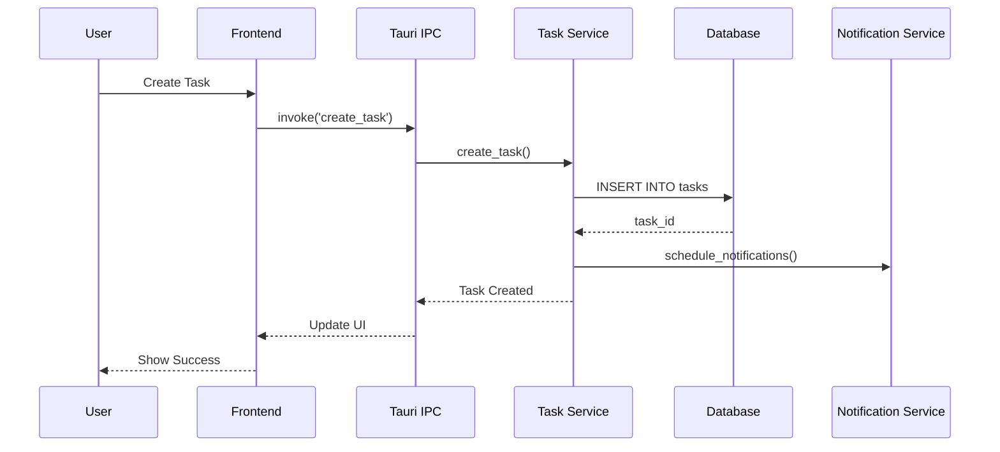
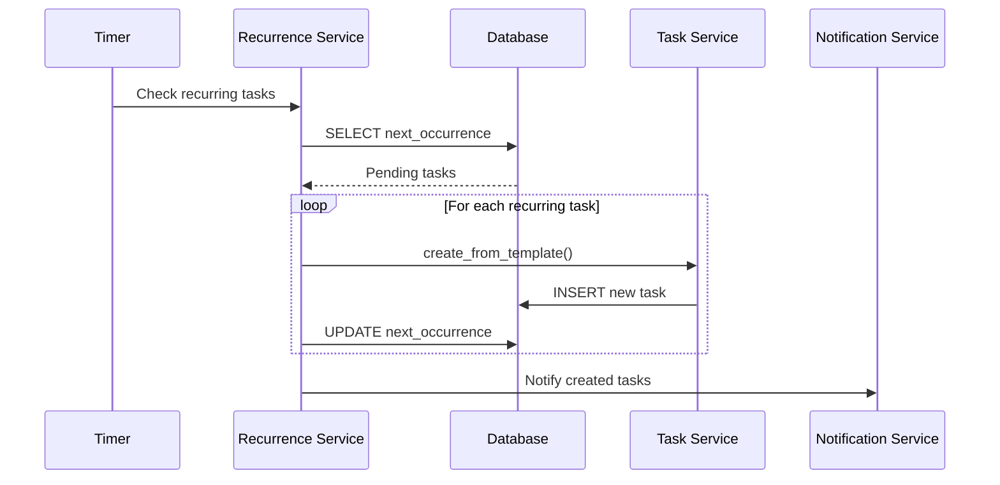
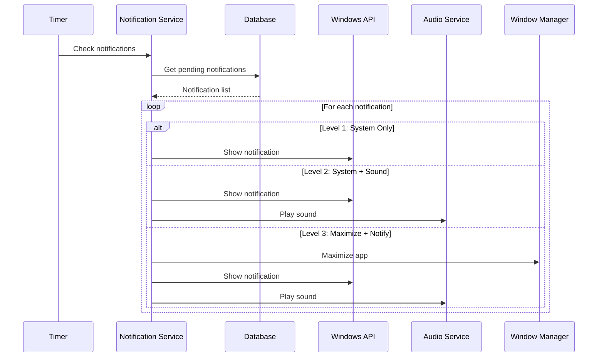

# Design Document - TaskNag

## 1. System Architecture

> **TaskNag** - 口うるさくて世話焼きなタスク管理アシスタントのアーキテクチャ設計

### 1.1 Overview
```
┌─────────────────────────────────────────────────────────┐
│                    Frontend (Web View)                   │
│  ┌─────────────┐  ┌─────────────┐  ┌─────────────┐    │
│  │    React    │  │   Zustand   │  │  TypeScript │    │
│  │ Components  │  │State Manager│  │   + Vite    │    │
│  └─────────────┘  └─────────────┘  └─────────────┘    │
└─────────────────────────────────────────────────────────┘
                              ↕
                    Tauri IPC Bridge (Commands/Events)
                              ↕
┌─────────────────────────────────────────────────────────┐
│                    Backend (Rust Core)                   │
│  ┌─────────────┐  ┌─────────────┐  ┌─────────────┐    │
│  │   Business  │  │  Database   │  │   System    │    │
│  │    Logic    │  │   Service   │  │ Integration │    │
│  └─────────────┘  └─────────────┘  └─────────────┘    │
│         ↓                ↓                  ↓           │
│  ┌─────────────────────────────────────────────────┐   │
│  │              SQLite Database                     │   │
│  └─────────────────────────────────────────────────┘   │
└─────────────────────────────────────────────────────────┘
```

### 1.2 Layer Architecture

#### Presentation Layer (Frontend)
- **Technology**: React + TypeScript
- **State Management**: Zustand
- **Styling**: Tailwind CSS + CSS Modules
- **Build Tool**: Vite
- **Components**:
  - TaskBoard: メインタスク管理ビュー
  - TaskCard: 個別タスク表示
  - NotificationPanel: 通知設定UI
  - QuickAdd: クイックタスク追加
  - SettingsView: アプリケーション設定

#### Business Logic Layer (Rust Backend)
- **Framework**: Tauri
- **Modules**:
  - `task_manager`: タスク管理ロジック
  - `notification_service`: 通知システム
  - `recurrence_engine`: 定期タスク処理
  - `database_service`: データベース操作
  - `system_tray`: システムトレイ管理

#### Data Layer
- **Database**: SQLite
- **ORM**: sqlx (async SQL toolkit)
- **Migration**: sqlx-migrate

### 1.3 Module Design

```rust
// src-tauri/src/main.rs
mod commands;
mod database;
mod models;
mod services;
mod system;

// Module structure
src-tauri/
├── src/
│   ├── main.rs
│   ├── commands/           # Tauri Commands
│   │   ├── mod.rs
│   │   ├── task.rs
│   │   ├── notification.rs
│   │   └── recurrence.rs
│   ├── models/             # Data Models
│   │   ├── mod.rs
│   │   ├── task.rs
│   │   ├── recurrence.rs
│   │   └── notification.rs
│   ├── services/           # Business Logic
│   │   ├── mod.rs
│   │   ├── task_service.rs
│   │   ├── notification_service.rs
│   │   └── recurrence_service.rs
│   ├── database/           # Database Layer
│   │   ├── mod.rs
│   │   ├── connection.rs
│   │   └── migrations/
│   └── system/            # System Integration
│       ├── mod.rs
│       ├── tray.rs
│       └── hotkeys.rs
```

## 2. UI/UX Design

### 2.1 Main Window Layout

```
┌────────────────────────────────────────────────────────────┐
│  [≡] Menu  [+] Quick Add  [🔍] Search         [⚙] [_][□][X]│
├────────────────────────────────────────────────────────────┤
│                                                             │
│  ┌──────────┬──────────┬──────────┬──────────┐           │
│  │  INBOX   │   TODO   │IN PROGRESS│   DONE   │           │
│  │    (5)   │   (12)   │    (3)    │   (45)   │           │
│  ├──────────┼──────────┼──────────┼──────────┤           │
│  │          │          │          │          │            │
│  │ ┌──────┐ │ ┌──────┐ │ ┌──────┐ │ ┌──────┐ │           │
│  │ │ Task │ │ │ Task │ │ │ Task │ │ │ Task │ │           │
│  │ │  🔴  │ │ │  🟡  │ │ │  🟢  │ │ │  ✓   │ │           │
│  │ └──────┘ │ └──────┘ │ └──────┘ │ └──────┘ │           │
│  │          │          │          │          │            │
│  └──────────┴──────────┴──────────┴──────────┘           │
│                                                             │
└────────────────────────────────────────────────────────────┘
```

### 2.2 Task Card Design

```
┌─────────────────────────────────┐
│ [🔴] High Priority     [⋮]      │
│                                  │
│ Task Title                       │
│ ▶ 2 subtasks (1/2 completed)    │
│                                  │
│ 📅 Due: 2025-01-15 16:00        │
│ 🔔 Level 2 (Sound)              │
│ 🏷 #work #urgent                │
│                                  │
│ [━━━━━━────] 60%                │
└─────────────────────────────────┘
```

### 2.3 Quick Add Dialog

```
┌─────────────────────────────────┐
│     Quick Add Task              │
├─────────────────────────────────┤
│ Title: [___________________]    │
│                                  │
│ Priority: [●Low ○Med ○High]     │
│ Due: [Today ▼] [16:00]         │
│ Tags: [___________________]     │
│                                  │
│ ☐ Create as recurring task      │
│                                  │
│ [Cancel]        [Add to Inbox]   │
└─────────────────────────────────┘
```

### 2.4 System Tray Menu

```
┌─────────────────────┐
│ 📋 Task Manager     │
├─────────────────────┤
│ ✓ 3 tasks today    │
│ ⏰ Next: 16:00      │
├─────────────────────┤
│ Quick Add...        │
│ Show/Hide           │
│ Settings            │
├─────────────────────┤
│ Exit                │
└─────────────────────┘
```

## 3. Data Flow Design

### 3.1 Task Creation Flow



### 3.2 Recurring Task Flow



### 3.3 Notification Flow



## 4. API Design

### 4.1 Tauri Commands

```rust
// Task Management
#[tauri::command]
async fn create_task(task: NewTask) -> Result<Task, String>

#[tauri::command]
async fn update_task(id: String, updates: TaskUpdate) -> Result<Task, String>

#[tauri::command]
async fn delete_task(id: String) -> Result<(), String>

#[tauri::command]
async fn get_tasks(filter: TaskFilter) -> Result<Vec<Task>, String>

#[tauri::command]
async fn move_task(id: String, status: TaskStatus) -> Result<Task, String>

// Subtask Management
#[tauri::command]
async fn create_subtask(parent_id: String, subtask: NewTask) -> Result<Task, String>

#[tauri::command]
async fn update_progress(id: String) -> Result<f32, String>

// Recurring Tasks
#[tauri::command]
async fn create_recurring_task(task: NewTask, rule: RecurrenceRule) -> Result<RecurringTask, String>

#[tauri::command]
async fn pause_recurring_task(id: String) -> Result<(), String>

#[tauri::command]
async fn resume_recurring_task(id: String) -> Result<(), String>

// Notifications
#[tauri::command]
async fn update_notification_settings(settings: NotificationSettings) -> Result<(), String>

#[tauri::command]
async fn test_notification(level: NotificationLevel) -> Result<(), String>
```

### 4.2 Frontend API Service

```typescript
// src/services/api.ts
export class TaskAPI {
  async createTask(task: NewTask): Promise<Task>
  async updateTask(id: string, updates: Partial<Task>): Promise<Task>
  async deleteTask(id: string): Promise<void>
  async getTasks(filter?: TaskFilter): Promise<Task[]>
  async moveTask(id: string, status: TaskStatus): Promise<Task>
  
  // Subtasks
  async createSubtask(parentId: string, task: NewTask): Promise<Task>
  async getSubtasks(parentId: string): Promise<Task[]>
  
  // Recurring
  async createRecurringTask(task: NewTask, rule: RecurrenceRule): Promise<RecurringTask>
  async pauseRecurring(id: string): Promise<void>
  async resumeRecurring(id: string): Promise<void>
}
```

## 5. State Management Design

### 5.1 Zustand Store Structure

```typescript
// src/stores/taskStore.ts
interface TaskStore {
  // State
  tasks: Task[]
  selectedTask: Task | null
  filter: TaskFilter
  isLoading: boolean
  
  // Actions
  loadTasks: () => Promise<void>
  createTask: (task: NewTask) => Promise<void>
  updateTask: (id: string, updates: Partial<Task>) => Promise<void>
  deleteTask: (id: string) => Promise<void>
  moveTask: (id: string, status: TaskStatus) => Promise<void>
  setFilter: (filter: TaskFilter) => void
  selectTask: (task: Task | null) => void
}

// src/stores/notificationStore.ts
interface NotificationStore {
  settings: NotificationSettings
  pendingNotifications: Notification[]
  
  updateSettings: (settings: Partial<NotificationSettings>) => Promise<void>
  dismissNotification: (id: string) => void
  snoozeNotification: (id: string, minutes: number) => void
}
```

## 6. Security Design

### 6.1 Data Security
- SQLite database encryption using SQLCipher
- Secure storage of sensitive settings using Windows Credential Manager
- Input validation and sanitization
- SQL injection prevention through parameterized queries

### 6.2 Application Security
- Code signing for Windows executable
- Auto-update verification
- Secure IPC communication between frontend and backend
- CSP (Content Security Policy) headers

## 7. Performance Optimization

### 7.1 Database Optimization
- Indexed columns for frequent queries
- Connection pooling
- Prepared statements cache
- Batch operations for bulk updates

### 7.2 UI Optimization
- Virtual scrolling for large task lists
- Lazy loading of task details
- Debounced search input
- Optimistic UI updates
- React.memo for expensive components

### 7.3 Background Processing
- Separate thread for notification checks
- Async task operations
- Efficient timer management
- Resource cleanup on idle

## 8. Error Handling Strategy

### 8.1 Backend Error Handling
```rust
#[derive(Debug, thiserror::Error)]
pub enum AppError {
    #[error("Database error: {0}")]
    Database(#[from] sqlx::Error),
    
    #[error("Task not found: {0}")]
    TaskNotFound(String),
    
    #[error("Invalid operation: {0}")]
    InvalidOperation(String),
    
    #[error("System error: {0}")]
    System(String),
}
```

### 8.2 Frontend Error Handling
```typescript
class ErrorBoundary extends Component {
  handleError(error: Error) {
    // Log to error tracking service
    // Show user-friendly error message
    // Offer recovery options
  }
}
```

## 9. Testing Strategy

### 9.1 Unit Tests
- Rust: Business logic, data models, services
- TypeScript: React components, utilities, stores

### 9.2 Integration Tests
- Tauri IPC commands
- Database operations
- Notification system

### 9.3 E2E Tests
- User workflows
- System tray interactions
- Hotkey functionality

## 10. Deployment Design

### 10.1 Build Pipeline
1. Run tests
2. Build Rust backend
3. Build React frontend
4. Bundle with Tauri
5. Sign Windows executable
6. Create installer (MSI/NSIS)

### 10.2 Update Mechanism
- Tauri Updater integration
- Delta updates for efficiency
- Rollback capability
- Update notifications

## Approval Status
- [x] Requirements Review Completed
- [ ] Design Review Completed
- [ ] Technical Feasibility Confirmed
- [ ] Ready for Implementation Phase

---
*Last Updated: 2025-01-13*
*Version: 1.0.0*