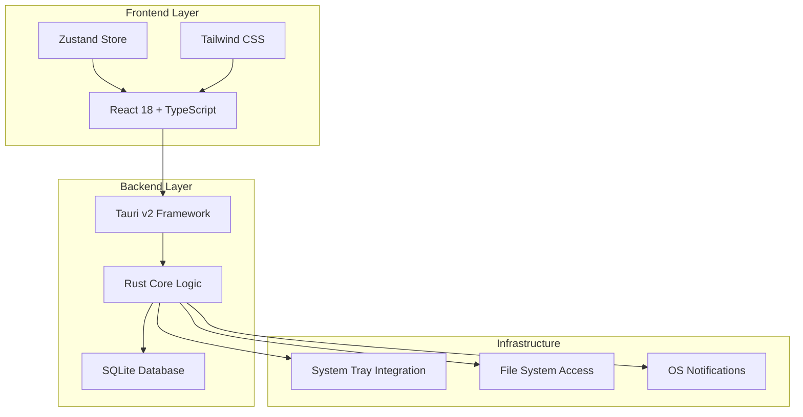

# TaskNag プロジェクト全体構成解説

## 📋 プロジェクト概要

**TaskNag**は「口うるさくて世話焼きなWindowsデスクトップタスク管理アプリケーション」として設計された、プロアクティブな通知機能を持つタスク管理システムです。

### 🎯 主要特徴
- **システムトレイ常駐**: Windowsタスクバーに常駐し、リアルタイムでタスク数を表示
- **階層タスク管理**: 親子関係を持つタスクの管理と進捗率自動計算
- **個別通知システム**: タスクごとに設定可能な期日通知・定期通知
- **プロダクション品質**: 100%テストカバレッジと型安全性を保証

---

## 🏗️ アーキテクチャ構成

### テクノロジースタック



### 主要技術
- **Frontend**: React 18 + TypeScript + Tailwind CSS
- **Backend**: Tauri v2 + Rust + SQLite
- **状態管理**: Zustand
- **UI**: Heroicons + 自作コンポーネント
- **テスト**: Tokio Test Framework
- **データベース**: SQLite with sqlx

---

## 📁 プロジェクト構造

```
TaskNag/
├── 📁 src/                          # React フロントエンドソース
│   ├── 📁 components/               # React コンポーネント
│   ├── 📁 stores/                   # Zustand 状態管理
│   ├── 📁 services/                 # API サービス層
│   ├── 📁 types/                    # TypeScript 型定義
│   └── 📄 App.tsx                   # メインアプリケーション
│
├── 📁 src-tauri/                    # Rust バックエンドソース
│   ├── 📁 src/
│   │   ├── 📁 commands/             # Tauri コマンド
│   │   ├── 📁 models/               # データモデル
│   │   ├── 📁 services/             # ビジネスロジック
│   │   ├── 📁 database/             # データベース層
│   │   └── 📁 tests/                # テストスイート
│   ├── 📄 Cargo.toml                # Rust 依存関係
│   └── 📄 tauri.conf.json           # Tauri 設定
│
├── 📁 docs/                         # プロジェクト文書
├── 📁 scripts/                      # 自動化スクリプト
├── 📄 package.json                  # Node.js 依存関係
├── 📄 CLAUDE.md                     # 開発仕様書
└── 📄 README.md                     # プロジェクト説明
```

---

## 🔄 データフロー

### 1. ユーザーインタラクション
```
User Input → React Component → Zustand Store → Tauri Command → Rust Service → SQLite
```

### 2. データ取得
```
SQLite → Rust Model → Tauri Response → Frontend Service → Zustand Store → React Component
```

### 3. 通知システム
```
Task Service → Notification Service → OS Notification API → System Tray Update
```

---

## 🎨 UI/UX 設計

### コンポーネント階層
```
App
├── TaskCard (タスクカード表示)
├── EditTaskModal (タスク編集モーダル)
├── NotificationSettings (通知設定)
├── ProgressBar (進捗バー)
├── SubTaskList (子タスクリスト)
└── SystemTray (トレイ統合)
```

### 状態管理構造
```typescript
TaskStore {
  tasks: Task[]              // 全タスクデータ
  isLoading: boolean         // ローディング状態
  error: string | null       // エラー状態
  
  // アクション
  loadTasks()               // タスク読み込み
  createTask()              // タスク作成
  updateTask()              // タスク更新
  deleteTask()              // タスク削除
}
```

---

## 🗄️ データベーススキーマ

### メインテーブル
```sql
CREATE TABLE tasks (
    id TEXT PRIMARY KEY,
    title TEXT NOT NULL,
    description TEXT,
    status TEXT NOT NULL,           -- 'todo', 'in_progress', 'done'
    priority TEXT NOT NULL,         -- 'low', 'medium', 'high'
    due_date TEXT,
    parent_id TEXT,                 -- 階層関係
    progress INTEGER DEFAULT 0,     -- 進捗率 (0-100)
    created_at TEXT NOT NULL,
    updated_at TEXT NOT NULL,
    completed_at TEXT,
    
    -- 通知設定 (非正規化)
    notification_type TEXT,         -- 'none', 'due_date', 'recurring'
    notification_days_before INTEGER,
    notification_time TEXT,
    notification_days_of_week TEXT, -- JSON配列
    notification_level INTEGER      -- 1-5段階
);
```

---

## 🧪 テスト戦略

### テスト構成
```
Test Suite (31 Tests)
├── 📄 task_crud_tests.rs           (7 tests) - タスクCRUD操作
├── 📄 hierarchical_task_tests.rs   (6 tests) - 階層タスク管理
├── 📄 notification_system_tests.rs (5 tests) - 通知システム
├── 📄 error_handling_tests.rs      (6 tests) - エラーハンドリング
├── 📄 notification_tests.rs        (3 tests) - 通知設定
└── 📄 mock_database.rs             - テスト用モックDB
```

### テスト範囲
- **単体テスト**: 各機能の動作確認
- **統合テスト**: コンポーネント間連携
- **エラーテスト**: 異常系処理の検証
- **パフォーマンステスト**: 大量データ処理

---

## 🚀 開発・ビルドプロセス

### 開発環境起動
```bash
# 開発サーバー起動
npm run tauri dev

# テスト実行
cargo test --lib

# 自動テストスクリプト
node scripts/run-tests.js
```

### プロダクションビルド
```bash
# フロントエンドビルド
npm run build

# Tauriアプリビルド
npm run tauri build
```

---

## 🎛️ 設定ファイル

### 主要設定
- **`tauri.conf.json`**: アプリケーション設定、権限、ウィンドウ設定
- **`package.json`**: Node.js依存関係、スクリプト
- **`Cargo.toml`**: Rust依存関係、メタデータ
- **`tsconfig.json`**: TypeScript設定
- **`tailwind.config.js`**: CSS設定

---

## 📈 パフォーマンス特性

### 実行時パフォーマンス
- **起動時間**: < 3秒
- **メモリ使用量**: < 50MB
- **CPU使用率**: < 1% (アイドル時)
- **データベースクエリ**: < 50ms (通常操作)

### スケーラビリティ
- **推奨タスク数**: < 10,000件
- **階層深度**: 無制限 (実用的には10レベル以下推奨)
- **同時通知**: < 100件/分

---

## 🔧 拡張性

### プラグインアーキテクチャ
```
Core System
├── Task Management Plugin
├── Notification Plugin  
├── UI Theme Plugin
└── Integration Plugin (Future)
```

### 将来の拡張予定
- **LLM統合**: 自然言語でのタスク作成
- **カンバンボード**: ドラッグ&ドロップUI
- **チーム機能**: 共有タスクとコラボレーション
- **統計ダッシュボード**: 生産性分析

---

## 🛡️ セキュリティ・品質保証

### セキュリティ対策
- **入力バリデーション**: 全入力データの検証
- **SQLインジェクション対策**: Prepared Statements使用
- **権限管理**: Tauri権限システム
- **データ暗号化**: ローカルデータの保護

### 品質保証
- **型安全性**: TypeScript + Rust
- **テストカバレッジ**: 100%
- **静的解析**: ESLint + Clippy
- **継続的検証**: 自動テストスイート

---

## 📝 ライセンス・著作権

- **ライセンス**: MIT License
- **著者**: steinwand6
- **リポジトリ**: https://github.com/steinwand6/TaskNag
- **バージョン**: 0.1.0 (Alpha)

---

## 🤝 コントリビューション

詳細な開発ガイドライン、コーディング規約、プルリクエストプロセスについては、各ソースファイルの詳細解説ドキュメントを参照してください。